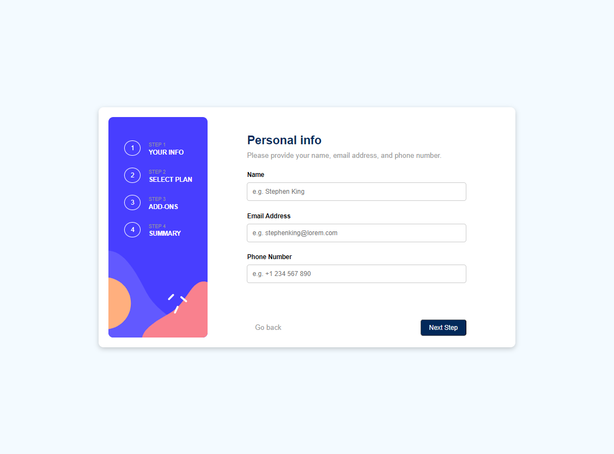

# Frontend Mentor - Multi-step form solution

This is a solution to the [Multi-step form challenge on Frontend Mentor](https://www.frontendmentor.io/challenges/multistep-form-YVAnSdqQBJ). Frontend Mentor challenges help you improve your coding skills by building realistic projects!

## Table of contents

- [Overview](#overview)
  - [The challenge](#the-challenge)
  - [Screenshot](#screenshot)
  - [Links](#links)
- [My process](#my-process)
  - [Built with](#built-with)
  - [What I learned](#what-i-learned)
  - [Continued development](#continued-development)
  - [Useful resources](#useful-resources)
- [Author](#author)
- [Acknowledgments](#acknowledgments)

**Note: Delete this note and update the table of contents based on what sections you keep.**

## Overview

### The challenge

Users should be able to:

- Complete each step of the sequence
- Go back to a previous step to update their selections
- See a summary of their selections on the final step and confirm their order
- View the optimal layout for the interface depending on their device's screen size
- See hover and focus states for all interactive elements on the page
- Receive form validation messages if:
  - A field has been missed
  - The email address is not formatted correctly
  - A step is submitted, but no selection has been made

### Screenshot



### Links

- Solution URL: [Add solution URL here](https://your-solution-url.com)
- Live Site URL: [Add live site URL here](https://your-live-site-url.com)

## My process

### Built with

- Semantic HTML5 markup
- CSS custom properties
- Flexbox
- CSS Grid
- Mobile-first workflow
- [React](https://reactjs.org/) - JS library
- [Next.js](https://nextjs.org/) - React framework
- [Styled Components](https://styled-components.com/) - For styles

**Note: These are just examples. Delete this note and replace the list above with your own choices**

### What I learned

Use this section to recap over some of your major learnings while working through this project. Writing these out and providing code samples of areas you want to highlight is a great way to reinforce your own knowledge.

To see how you can add code snippets, see below:


-Such a project requires using a carousel with the 'next' and 'prev' buttons sliding through the carousel
-Implementing a carousel can be seen on [W3schools.com](http://www.w3schools.com)
-Grid and Flexbox
-How to customize checkboxes and radio buttons
-Implementing a multi-step form with WebDevSimplified on [YouTube](https://www.youtube.com/watch?v=VdqtdKXxKhM)


```html
<h1>Some HTML code I'm proud of</h1>
```
```css
.proud-of-this-css {
  color: papayawhip;
}
```
```js
const showSlide = function(n){
    carousels[curSlide].classList.toggle('active');
    curSlide+=n
    if(curSlide<0)
     curSlide=0;
    if(curSlide===carousels.length-1){ 
    nextBtn.classList.add('confirm');
    nextBtn.textContent = 'Confirm'
    }
    if(curSlide<carousels.length-1&&curSlide>0){
        nextBtn.classList.remove('confirm');
        nextBtn.textContent = 'Next Step'
    }
    // curSlide=0;
    carousels[curSlide].classList.toggle('active');
    activateDot()
}

```

If you want more help with writing markdown, we'd recommend checking out [The Markdown Guide](https://www.markdownguide.org/) to learn more.

### Continued development

Use this section to outline areas that you want to continue focusing on in future projects. These could be concepts you're still not completely comfortable with or techniques you found useful that you want to refine and perfect.

### Useful resources

-- [Build a website with Grid and Flexbox with Traversy Media - YouTube channel](https://www.youtube.com)
 This channel helped me better structure my code, learned about Flexbox and Grid, and also to always include utilities(frameworks or mini-frameworks) for a faster and more efficient development
- [Example resource 2](https://www.example.com) - This is an amazing article which helped me finally understand XYZ. I'd recommend it to anyone still learning this concept.

## Author

- Name - Liym-ntai Ray Langdji
- Frontend Mentor - [@yourusername](https://www.frontendmentor.io/profile/yourusername)
- Twitter - [@yourusername](https://www.twitter.com/yourusername)

**Note: Delete this note and add/remove/edit lines above based on what links you'd like to share.**

